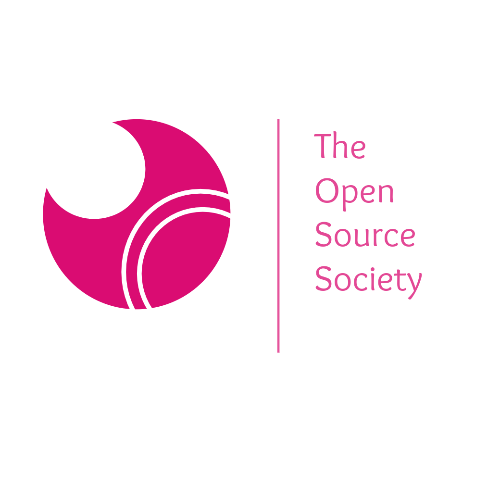

# TheOSS
The Open Source Society(TOSS) Official website. (In Progress)

## Development

1. Fork the repo
2. Clone master branch
3. cd theOSS
4. git checkout -b devBranch
5. Make your contribution :)

## Dependencies 
1.Python3 (https://www.python.org/)

## Libraries

1. Flask (pip install flask)

### To run the Flask server

python wsgi.py

### CSS library used

1. Tailwind CSS
